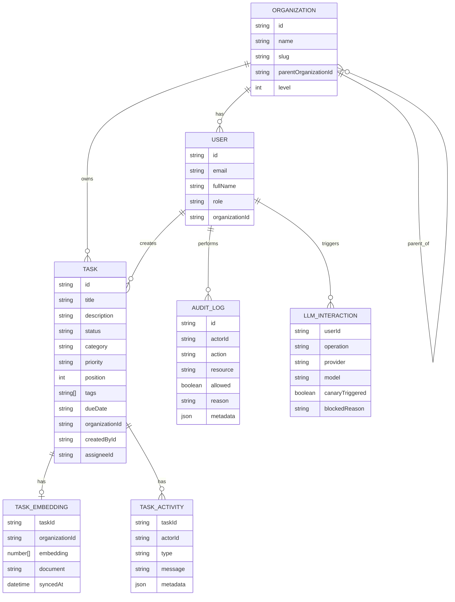

# Enterprise OS — Task Management Platform

A full-stack Nx monorepo with JWT auth, role-based access control, AI-powered task management, semantic duplicate detection, and an AI standup report generator.

## Monorepo Layout

| Package | Description |
|---|---|
| `apps/api` | NestJS REST API — auth, RBAC, tasks, AI, audit, reports |
| `apps/dashboard` | Angular 20 + Tailwind + NgRx SPA |
| `libs/data` | Shared enums, DTOs, and models (client + server) |
| `libs/auth` | Permission helpers and NestJS decorators |
| `libs/ai` | Embeddings, RAG, intent parsing, guardrails |

---

## Setup

**Prerequisites:** Node.js 22.x, npm 10+, PostgreSQL (Neon recommended)

```bash
npm install
cp .env.example .env   # fill in DATABASE_URL and JWT_SECRET
npm run db:migrate
npm run db:seed
```

**Run locally:**

```bash
npm run dev:api        # http://localhost:4000/api
npm run dev:dashboard  # http://localhost:4200
```

**Seeded accounts:**

| Email | Password | Role |
|---|---|---|
| `owner@acme.test` | `Password123!` | Owner |
| `admin@acme.test` | `Password123!` | Admin |
| `viewer@acme.test` | `Password123!` | Viewer |
| `field-admin@acme.test` | `Password123!` | Admin (child org) |

---

## Features

### Task Board
- Kanban board with **Board / List / Analytics** view modes
- CDK drag-and-drop for reordering and moving tasks between columns
- Filters: search, category, sort — all debounced and synced to NgRx store
- Global loading bar + board overlay + disabled buttons during every mutation
- Keyboard shortcuts: `C` create · `/` focus search · `1/2/3` switch views · `Esc` close modal

### Semantic Duplicate Detection
Before saving a new task the API embeds the title and description using a bag-of-words cosine similarity model and compares against every existing task in the organisation's scope.

- Threshold: **0.80** cosine similarity
- Blocked creation returns `400` with the matching task list and similarity scores
- The frontend shows a toast with the conflicting task names
- Works without an OpenAI key (local `embedText` fallback)
- All blocked attempts are recorded in the audit log with `reason: duplicate_detected`

### AI Chat
Natural-language interface grounded on the user's own task corpus.

- **Intent classification**: `create_task` · `update_task` · `delete_task` · `query`
- **Create from chat**: parses `title as X`, `description as X`, priority, due date, and tags from free text
  - Example: *"a task with high priority and title of task as Security Update and description of task as update the security for auth"*
- **Query**: semantic RAG retrieval — answers are grounded on retrieved tasks only, formatted as bullet lists, no task IDs exposed
- **Pending actions**: mutations require a Confirm step before executing
- **Streaming**: SSE-based token streaming with live typing indicator
- **Prompt injection detection** and canary token output guardrail
- **D3 similarity chart** in the sidebar showing match scores for the latest cited tasks

### AI Standup Report
`GET /api/reports/standup` queries all tasks updated in the last 24 hours, builds a structured prompt, and returns a markdown report with:
- Key accomplishments
- Work in progress
- Upcoming priorities
- Blockers

Falls back to a local template report when no OpenAI key is configured.
The frontend renders the markdown with custom CSS (headers, styled list cards, fade-in animation) and includes a one-click copy button.

### Role-Based Access Control

| Role | Scope |
|---|---|
| `owner` | Own org + all direct child organisations |
| `admin` | Own organisation only |
| `viewer` | Read-only, own organisation only |

Permissions: `task:read` · `task:create` · `task:update` · `task:delete` · `task:reorder` · `audit:read`

### Audit Log
Every protected action is recorded — including denied attempts and duplicate blocks — with actor, timestamp, resource, and reason. Readable by Admin/Owner only.

### Team Management
Admin/Owner can invite new members, assign roles, and remove users from their organisation scope.

---

## Architecture

### Backend Modules

| Module | Responsibility |
|---|---|
| `auth` | Login, JWT validation, global guard, permission guard |
| `tasks` | Scoped CRUD, filters, reorder, duplicate detection |
| `ai` | Embedding sync, RAG retrieval, intent execution, chat history |
| `chat` | SSE streaming, pending action lifecycle |
| `reports` | Standup report generation |
| `users` | Team member management |
| `audit` | Persistent audit log write + restricted read |
| `organizations` | 2-level hierarchy access resolution |
| `database` | TypeORM config, entities, migrations |

### Frontend Structure

- **NgRx slices**: `auth`, `tasks`, `audit`
- **HTTP interceptor**: bearer token attachment
- **Route guards**: `authGuard`, `adminGuard`
- **`ApiService`**: typed wrappers for every endpoint including SSE streaming
- **`TaskModalComponent`**: create / edit with reactive form
- **`AiChatPageComponent`**: streaming chat, D3 chart, formatted message renderer
- **`StandupReportPageComponent`**: markdown-to-HTML renderer with styled output

### AI Library (`libs/ai`)

| Module | Purpose |
|---|---|
| `embeddings` | 64-dim bag-of-words `embedText` + `cosineSimilarity` |
| `rag` | `buildTaskDocument`, `buildGroundedAnswerPrompt` |
| `intents` | `classifyIntent`, `parseIntent` — title/description/priority/tag extraction |
| `guardrails` | Prompt injection detection, canary token leak detection |

---

## Data Model



---

## API Reference

### Auth
| Method | Path | Description |
|---|---|---|
| `POST` | `/api/auth/login` | Returns JWT + user profile |
| `POST` | `/api/auth/register` | Creates account + returns JWT |
| `GET` | `/api/auth/me` | Current user from JWT |

The public auth and invitation endpoints (`login`, `register`, `forgot-password`,
`reset-password`, invite create/accept) are rate limited per IP and return `429`
once the window is exceeded. Login additionally locks an account for
`LOGIN_LOCKOUT_SECONDS` after `LOGIN_MAX_FAILED_ATTEMPTS` consecutive failures,
also returning `429`; a successful login clears the counter.

### Tasks
| Method | Path | Description |
|---|---|---|
| `GET` | `/api/tasks` | List tasks (scoped, filterable) |
| `POST` | `/api/tasks` | Create task — runs duplicate check first |
| `GET` | `/api/tasks/:id` | Task detail with activity log |
| `PUT` | `/api/tasks/:id` | Partial update |
| `DELETE` | `/api/tasks/:id` | Delete |
| `PATCH` | `/api/tasks/reorder` | Persist drag-and-drop order + status |

**Duplicate detection response (400):**
```json
{
  "message": "Potential duplicate tasks detected",
  "duplicates": [
    { "id": "uuid", "title": "Fix login bug", "similarity": 0.847 }
  ]
}
```

### AI Chat
| Method | Path | Description |
|---|---|---|
| `POST` | `/api/chat/ask` | SSE stream — returns chunks then full message |
| `GET` | `/api/chat/history` | Conversation history |
| `POST` | `/api/chat/pending-actions/:id/confirm` | Execute a pending mutation |
| `POST` | `/api/chat/pending-actions/:id/cancel` | Dismiss a pending mutation |

### Reports
| Method | Path | Description |
|---|---|---|
| `GET` | `/api/reports/standup` | AI standup report for last 24h |

### Users
| Method | Path | Description |
|---|---|---|
| `GET` | `/api/users` | List users in scope |
| `POST` | `/api/users` | Invite team member (Admin+) |
| `DELETE` | `/api/users/:id` | Remove member (Admin+) |

### Audit
| Method | Path | Description |
|---|---|---|
| `GET` | `/api/audit-log` | Paginated audit log (Admin/Owner) |

---

## Testing

```bash
npm test                          # all projects
npx nx test api                   # API unit tests
npx nx test auth                  # auth lib tests
```

Test coverage includes:
- Permission and org scope helpers (`libs/auth`)
- Duplicate detection math and threshold validation (`tasks-dedup.spec.ts`)
- Intent parsing — title/description/priority extraction from free text (`intents.spec.ts`)
- Organisation scope resolution (`organizations.service.spec.ts`)
- Frontend auth reducer (`auth.reducer.spec.ts`)

---

## Production Deployment

**Build:**
```bash
npx nx build api --configuration=production
npx nx build dashboard --configuration=production
```

**Start API with PM2:**
```bash
pm2 start ecosystem.config.js --env production
pm2 save && pm2 startup
```

**Required env vars:**
```
DATABASE_URL=postgresql://...
JWT_SECRET=...
CORS_ORIGIN=https://your-domain.com
PORT=4000

# Optional — AI features fall back to local models without these
OPENAI_API_KEY=sk-...
OPENAI_MODEL=gpt-4o-mini
EMBEDDING_MODEL=text-embedding-3-small

# Optional — auth rate limiting & brute-force protection (defaults shown)
AUTH_RATE_LIMIT_TTL_SECONDS=60    # per-IP window on auth + invite routes
AUTH_RATE_LIMIT_MAX=10            # max requests per IP per window
LOGIN_MAX_FAILED_ATTEMPTS=5       # failed logins per account before lockout
LOGIN_LOCKOUT_SECONDS=900         # account lockout duration
TRUST_PROXY=1                     # proxy hops to trust for the real client IP
```

> Behind a reverse proxy, keep `TRUST_PROXY=1` (the default) so per-IP rate
> limiting keys on the real client IP from `X-Forwarded-For` rather than the
> proxy's address. See the Nginx config below for the matching header.

**Nginx — serve dashboard SPA + proxy API:**
```nginx
location /turbo-vets/ {
    alias /path/to/dist/apps/dashboard/browser/;
    index index.html;
    try_files $uri $uri/ /turbo-vets/index.html;
}

location /api/ {
    proxy_pass http://127.0.0.1:4000;
    proxy_buffering off;   # required for SSE streaming
    proxy_cache off;
    proxy_read_timeout 300s;
    proxy_set_header Host $host;
    proxy_set_header X-Forwarded-Proto $scheme;
    proxy_set_header X-Forwarded-For $proxy_add_x_forwarded_for;  # real client IP for rate limiting
}
```

Live: **https://srv1180359.hstgr.cloud/turbo-vets/**
