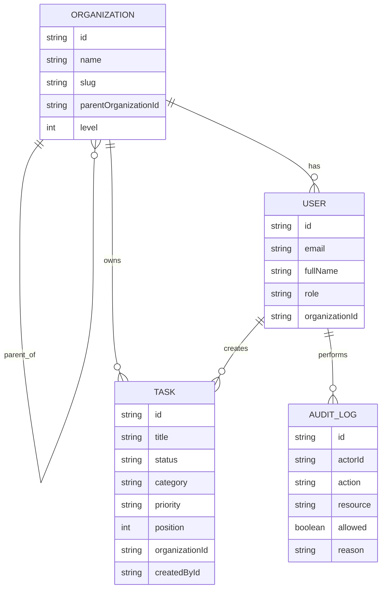

# Secure Task Management System

An Nx monorepo implementation of the full stack assessment:

- `apps/api`: NestJS API with JWT auth, RBAC, audit logging, and PostgreSQL via TypeORM
- `apps/dashboard`: Angular + Tailwind dashboard with NgRx state and drag-and-drop task management
- `libs/data`: shared enums, contracts, and frontend/backend models
- `libs/auth`: shared permission helpers and Nest decorators

## Setup

Prerequisites:

- Node.js 22.x recommended
- npm 10+
- Neon PostgreSQL database

Install dependencies:

```bash
npm install
```

Create `.env` from `.env.example`:

```bash
cp .env.example .env
```

Run database migration and seed data:

```bash
npm run db:migrate
npm run db:seed
```

Run the backend:

```bash
npm run dev:api
```

Run the frontend:

```bash
npm run dev:dashboard
```

The dashboard script sets `CI=1` to avoid a flaky Angular/Nx builder issue observed in this workspace.

Default local URLs:

- API: `http://localhost:3000/api`
- Dashboard: `http://localhost:4200`

Seeded accounts:

- `owner@acme.test` / `Password123!`
- `admin@acme.test` / `Password123!`
- `viewer@acme.test` / `Password123!`
- `field-admin@acme.test` / `Password123!`

## Architecture Overview

### Nx layout

- `apps/api` owns HTTP, auth, persistence, and business rules
- `apps/dashboard` owns UI, route protection, data-fetching flows, and task interactions
- `libs/data` prevents enum/DTO drift between client and server
- `libs/auth` centralizes reusable permission logic and route decorators

### Backend modules

- `auth`: login, JWT validation, global auth guard, permission guard
- `organizations`: 2-level hierarchy access resolution
- `tasks`: scoped CRUD, filtering, sorting, and reorder endpoint
- `audit`: persistent audit log storage and restricted read access
- `database`: TypeORM config, entities, migrations

### Frontend structure

- NgRx slices for `auth`, `tasks`, and `audit`
- HTTP interceptor for bearer token attachment
- Route guards for authenticated and admin/owner-only routes
- Responsive task board with CDK drag-and-drop and modal create/edit flow

## Data Model

Entities:

- `Organization`: self-referencing parent/child hierarchy with max intended depth of 2
- `User`: belongs to one organization and has one role
- `Task`: belongs to one organization and one creator, includes board `status` and `position`
- `AuditLog`: records protected actions, allow/deny result, actor metadata, and reason

Mermaid ERD:



## Access Control

Roles:

- `owner`: full task access for its organization plus direct child organizations
- `admin`: full task access only within its own organization
- `viewer`: read-only task access only within its own organization

Permissions:

- `task:read`
- `task:create`
- `task:update`
- `task:delete`
- `task:reorder`
- `audit:read`

Implementation notes:

- JWT auth is enforced globally; `POST /auth/login` is explicitly public
- Permission checks use `@RequirePermissions(...)` from `libs/auth`
- Organization scope is enforced inside task service methods before mutation or filtered reads
- Audit log reads are limited to Owner/Admin roles
- All protected task operations record audit rows, including denied scope checks inside the task service

## API Documentation

### `POST /api/auth/login`

Request:

```json
{
  "email": "owner@acme.test",
  "password": "Password123!"
}
```

Response:

```json
{
  "accessToken": "jwt-token",
  "user": {
    "id": "uuid",
    "email": "owner@acme.test",
    "fullName": "Olivia Owner",
    "role": "owner",
    "organizationId": "uuid",
    "organizationName": "Acme HQ"
  }
}
```

### `GET /api/auth/me`

Returns the authenticated user profile resolved from the JWT.

### `GET /api/tasks`

Supported query params:

- `status`
- `category`
- `search`
- `sortBy`
- `order`
- `organizationId`

Example:

```bash
curl -H "Authorization: Bearer <token>" \
  "http://localhost:3000/api/tasks?status=todo&search=security"
```

### `POST /api/tasks`

Example request:

```json
{
  "title": "Review quarterly security checklist",
  "description": "Validate RBAC and vendor access.",
  "category": "ops",
  "priority": "high",
  "status": "todo"
}
```

### `PUT /api/tasks/:id`

Partial update for title, description, category, priority, and status.

### `DELETE /api/tasks/:id`

Deletes the task if the caller is allowed to mutate that organization scope.

### `PATCH /api/tasks/reorder`

Persists board ordering and status changes from drag-and-drop.

Request:

```json
{
  "tasks": [
    { "id": "task-1", "status": "in_progress", "position": 0 },
    { "id": "task-2", "status": "in_progress", "position": 1 }
  ]
}
```

### `GET /api/audit-log`

Owner/Admin only.

```bash
curl -H "Authorization: Bearer <token>" \
  "http://localhost:3000/api/audit-log?limit=100"
```

## Testing

Run all configured tests:

```bash
npm test
```

Implemented test coverage includes:

- shared permission and scope helpers
- organization scope resolution rules
- frontend auth reducer session behavior

## Future Considerations

- refresh tokens and rotation for longer-lived sessions
- CSRF protection if the auth transport moves to cookies
- permission caching for large org graphs
- richer audit capture around global guard denials
- organization management UI and delegated role administration
- stronger frontend build hardening once the environment is pinned to a supported Angular Node runtime

## Notes

- This workspace was implemented against a Node `23.x` environment. Angular 20 officially targets Node `20.19+`, `22.12+`, or `24+`. The dashboard source passes TypeScript and Angular compilation checks, but the full Angular application builder is unstable in this unsupported runtime. Using Node 22 is the intended path.
